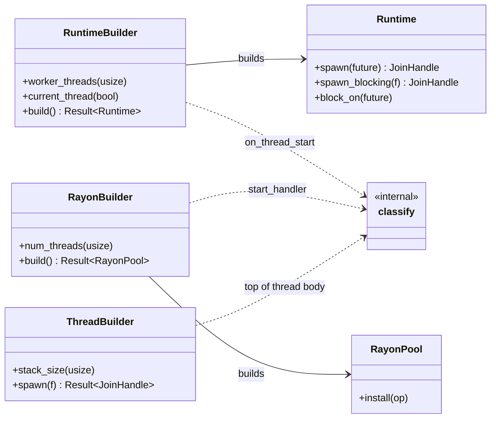
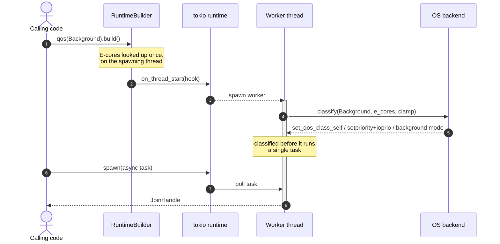

# bgrt — Design

The lasting design of `bgrt`: the mechanism, the decisions, and what turned up
along the way. For status and the release plan see [`ROADMAP.md`](ROADMAP.md);
for the module map see [`../CLAUDE.md`](../CLAUDE.md).

## Purpose

Run units of work — async tasks and OS threads — at a low energy footprint:
efficiency cores, low clock speed, no fan spin-up. It works as an ordinary
non-admin user on macOS, Windows, and Linux, including P+E and big.LITTLE
processors. The work is ordinary async or sync Rust; what changes is the executor
it runs on.

## Goals and non-goals

Goals:

- Per-thread and per-executor energy classification, without privileges.
- Keep background work from waking the performance cores or the fans.
- Never starve. Low-priority work still moves forward under load.
- Wrap tokio rather than fork it.

Non-goals:

- **Setting a CPU frequency or switching the governor.** That is firmware and
  governor territory, and it is system-wide. What the library does express is a
  per-thread frequency *bias*: on Linux the optional `uclamp` cap
  (`clamp_frequency`) lowers the clock the governor picks for a `Background`
  thread. It is a hint rather than a setting, and it needs no privileges.
- **A hard CPU-time quota**, such as "30% of a core". That is a different axis; on
  Linux it belongs to cgroups, and it is not what "stay cool" means here.
- **Per-task reclassification.** Classification is per thread and set once.
- **Replacing tokio.** `bgrt` configures a tokio runtime.
- **GPU work of any kind.** See [Scope](#scope-cpu-and-io-now-gpu-probably-never).
  It is not planned and is unlikely, but the objections describe the current state
  of the platforms rather than a principle, so they are written as conditions that
  could change.

`bgrt` is a scheduling-hint library for CPU and block I/O; one `QosClass` governs
both. GPU is out of scope for the foreseeable future. The reasoning for both is
below, because "why not do X" is worth answering once in writing.

## The mechanism

Every modern OS exposes a per-thread energy quality-of-service hint. Setting it
tells the scheduler to optimize the thread for energy rather than speed, which it
turns into both efficiency-core placement and a downward DVFS bias. The library
states intent and lets the kernel do what suits the machine. It never sets a
frequency directly.

The whole thing is built on one operation: apply a `QosClass` to the *current*
thread, called from a runtime's thread-start hook or at the top of a spawned
thread. It needs no privileges because it only ever lowers a thread's own
demands.

## QoS classes and per-OS mapping

The mapping table lives in [the README](../README.md#qos-classes). It was once
restated in four files and had drifted in three of them, so this section carries
only the reasoning.

- **`Background` is the class that never wakes the fans.** On Apple Silicon it is
  confined to the efficiency cores, and keeping work off the performance cores is
  what actually avoids the turbo and fan spike.
- **`Utility` sits between the two.** On macOS,
  `Background` can be very slow because of that core confinement; LLVM and clangd
  hit this and switched to `Utility`. It lowers priority without confining the
  work to a core type.

### Platform notes for future backends

- **FreeBSD:** `setpriority(PRIO_PROCESS, 0, nice)` is process-wide there, so the
  Linux backend cannot be copied across. FreeBSD threads have kernel LWPs, but
  `PRIO_PROCESS` targets the whole process; the right call is
  `setpriority(PRIO_THREAD, 0, nice)`, a BSD extension for per-LWP niceness.
  Until someone writes that, FreeBSD lands on the no-op fallback, so the API is
  safe to call there.

### Anti-starvation

Each `Background` mapping is weighted-fair rather than run-only-when-idle, so
low-priority work keeps a small share under contention.

- Linux uses `nice(19)` rather than `SCHED_IDLE`, which can starve a thread to
  nearly nothing indefinitely.
- Windows uses EcoQoS with `BELOW_NORMAL` rather than `THREAD_PRIORITY_IDLE`.
  EcoQoS is separate from priority: it handles efficiency, priority handles
  fairness.
- macOS background QoS is priority-band time-sharing on the efficiency cores, not
  idle-only.

## Architecture

A `bgrt` library crate plus a `bgrt-bench` measurement binary.

### Modules

- `qos` — `QosClass`, marked `#[non_exhaustive]`; see the README's stability
  section. `backend/` dispatches `apply(QosClass)` per OS: `macos`
  (`pthread_set_qos_class_self_np`), `linux` (`setpriority` plus
  `backend/ioprio.rs`), `windows` (background mode, `SetThreadInformation` for
  EcoQoS, `SetThreadPriority`, and the memory-priority restore), with a no-op
  fallback elsewhere. `backend/uclamp.rs` adds the optional Linux frequency
  clamp and does nothing on other platforms.
- `runtime` (feature `tokio`, on by default) — `RuntimeBuilder` builds a
  `Runtime` around a multi-thread tokio runtime whose `on_thread_start` applies
  the class to every runtime thread, workers and blocking pool alike.
  `current_thread(true)` selects tokio's current-thread scheduler instead; see
  below.
- `rayon_pool` (feature `rayon`, opt-in) — `RayonBuilder` builds a `RayonPool`
  around `rayon::ThreadPool`, with a `start_handler` that classifies every rayon
  thread. `RayonPool` derefs to `rayon::ThreadPool`, and `pool.install(|| …)`
  routes `par_iter`, `join`, and `scope` work through the low-priority threads.
- `thread` — `spawn_thread` and `ThreadBuilder`, for code that is neither async
  nor rayon. Available with no feature flags.
- `topology` — efficiency-core detection (Linux sysfs `cpu_capacity` and the
  hybrid PMUs, Windows `GetSystemCpuSetInformation`) plus Linux-only affinity.
- `telemetry` (feature `telemetry`, opt-in) — measurement primitives for the
  harness.

### The shape of the API

Three builders share one classification path. They are parallel on purpose: each
exposes the same trio of knobs (`qos`, `pin_efficiency_cores`,
`clamp_frequency`) and resolves them the same way, so learning one is learning
all three. A new knob is added to all three, or the asymmetry gets explained.

Each box below lists only what makes that builder different. The shared trio is
stated in the paragraph above; printing it in all three boxes would say one thing
three times and bury the part that matters, which is the three edges meeting at
`classify`.

`classify` is the one call site for the three per-thread operations, in order:
`backend::apply(class)` always, then `topology::pin_current_thread` and
`backend::uclamp::clamp_current_thread` if those Linux-only, off-by-default knobs
were set. One function with three callers is what keeps the builders in step.

The diagram leaves out two things worth knowing: `RayonPool` derefs to
`rayon::ThreadPool`, so the whole rayon API is reachable through it, and
`spawn_thread(class, f)` is a shortcut past `ThreadBuilder` for the case with no
knobs to set.

### When classification happens, and why it has to be then

A thread is classified by whoever creates it, at the moment it starts — never
afterwards, and never from outside. That single property shapes the rest of the
design.

Two things follow from that sequence:

- **The thread-start hook is where the work happens.** `bgrt` is a thin layer;
  what it provides is that the classification call reaches every thread the
  executor owns, tokio's blocking pool included, before any task runs on it.
- **Threads `bgrt` did not create are out of reach.** A worker can only classify
  itself, since `pthread_set_qos_class_self_np` and
  `THREAD_MODE_BACKGROUND_BEGIN` both act on the calling thread only. No step
  could be added to the diagram later to catch a library's own pool. See the
  inheritance entry under [Findings](#findings-worth-remembering).

### The two-runtime pattern

Running some work normally and other work at low priority is a matter of which
executor the work is spawned onto, rather than a flag flipped per task: keep a
`Default`-class `Runtime` and a `Background`-class one in the same process, and
spawn onto whichever fits. That shape also avoids Linux's one-way `nice` — an
unprivileged thread cannot raise its own priority again — by classifying each
worker once, at creation.

### The current-thread runtime owns its driver thread

`RuntimeBuilder::current_thread(true)` gives single-threaded task semantics, but
it does not drive tasks on the caller's thread the way tokio's current-thread
runtime does. `bgrt` spawns one OS thread through `ThreadBuilder`, so it is
classified like any other `bgrt` thread, builds the current-thread runtime there,
and parks it in `Runtime::block_on` for the runtime's lifetime.

That indirection exists because the obvious implementation is unsound here, in
two separate ways.

1. **The hook does not fire for the driver.** On a current-thread runtime,
   `on_thread_start` fires only for blocking-pool threads. Measured: the async
   task saw `QOS_CLASS_DEFAULT` while a `spawn_blocking` closure on the same
   runtime saw `QOS_CLASS_BACKGROUND`. The async work — the part that matters —
   would run unclassified.
2. **Classifying the caller instead is not an option.** That thread belongs to
   someone else, and on Linux an unprivileged thread can lower its niceness but
   never raise it again, so `bgrt` would permanently deprioritize a thread it does
   not own. It is the same constraint behind the two-runtime pattern above.

Owning the thread solves both. The costs are a shutdown path that crosses a
thread boundary — a `oneshot` carrying the teardown mode, so all three tokio
shutdown behaviours survive — and a `block_on` that goes through
`Handle::block_on`, which is only sound because the driver thread keeps the I/O
and timer drivers running.

This mode is not the default and is rarely the right choice. `worker_threads(1)`
costs the same single thread — both modes measure as +1 — without the hazard that
one blocking task stalls every other task. `current_thread` is for cases that
genuinely need single-threaded task semantics.

### Efficiency-core detection vs. pinning

These are separate concerns with different platform support.

Detection answers which CPUs are the small ones, and telemetry uses it to label
samples. Linux reads sysfs `cpu_capacity`; Windows reads `EfficiencyClass` from
`GetSystemCpuSetInformation`. Both scales run higher-is-faster, so both reduce to
the same pure function: take the CPUs at the minimum value, and report an
all-equal machine as homogeneous — an empty set — rather than as a machine where
every core is an efficiency core. Keeping that decision in one testable function
is what allows it to be checked on a machine with neither topology. macOS has no
unprivileged equivalent, so detection returns empty there.

The all-equal case now runs on real hardware rather than only in a unit test. The
aarch64 CI runner is a Neoverse N2 that publishes `cpu_capacity` for all four
CPUs with the same value, 1024 — present, so the read path executes, and uniform,
so the answer must be "homogeneous" and not "four efficiency cores". Detection
returns empty and `%E` reads `n/a`. The Windows arm64 runner reports a uniform
`EfficiencyClass` and reads the same way, while its frequency telemetry works
(3398 MHz of a 3399 MHz part), so `CallNtPowerInformation` is exercised on
aarch64 too.

Pinning is Linux only. `pin_efficiency_cores(true)` adds `sched_setaffinity` over
the detected set. It is off by default because pinning is a hard restriction that
hurts once the efficiency cores are saturated. It stays a no-op on macOS and
Windows even though Windows detection works, because QoS and EcoQoS already place
work on efficient cores, and a hard affinity mask would fight the scheduler's own
hybrid placement rather than help it. Knowing which cores are efficient is not a
reason to override an OS that is already doing the job.

#### Detection on x86 needs a second source

`cpu_capacity` appears not to exist on x86 at all. It arrived in 2016 as an
arm and arm64 attribute (`arch_topology.c`, `CONFIG_GENERIC_ARCH_TOPOLOGY`);
Intel proposed a different interface in 2020 rather than adopting it; and while
`intel_pstate` has fed asymmetric capacity to the scheduler since 2024, it does
so through an x86-specific per-CPU variable rather than the generic topology code
that publishes the sysfs file.

So for a while, `pin_efficiency_cores(true)` was almost certainly a silent no-op
on every Intel hybrid CPU. That is the failure this project worries about most,
because it looks exactly like the correct no-op on a homogeneous machine. Nothing
in a test run tells the two apart.

The fix was a second source: the hybrid perf PMUs. The kernel registers
`cpu_core` and `cpu_atom` PMUs on hybrid x86, each with a `cpus` file; on an
i9-12900K, `cpu_atom/cpus` reads `16-23`. It needs no privileges, it names the
efficiency cores outright rather than requiring a minimum-wins guess, and it is
absent on non-hybrid machines, so the homogeneous case still yields empty.
`efficiency_cores()` tries `cpu_capacity` first and then the PMU.

AMD hybrid parts are out of scope on purpose. Zen 4c and Zen 5c "dense" cores use
the same ISA and microarchitecture as their siblings, differing in clock ceiling
and cache, so they share a PMU and there is no `cpu_atom` equivalent. The kernel
does know the core type (CPUID `0x80000026`, `X86_FEATURE_AMD_HTR_CORES`) but
exposes it to userspace only through debugfs (`/sys/kernel/debug/x86/topo/`),
which is root-only and something this library will not require. Detection returns
empty, which disables pinning rather than pinning to a wrong set. Worth revisiting
if that core type ever gains an interface outside debugfs; the Zen 6 low-power
core work suggests pressure is building.

Core type is deliberately not inferred from `cpufreq/cpuinfo_max_freq`. Per-core
boost binning and ITMT favoured cores make genuinely homogeneous CPUs report
different maximums, so a minimum-wins rule over that field would mistake a binned
Threadripper for a hybrid and confine background work to one arbitrary core.

Both sysfs paths are still unverified on real hardware. The cpulist parser is
unit-tested against published 12900K values and against malformed input, so the
decision is covered off-hardware, but neither the `cpu_capacity` read on arm64 nor
the PMU read on x86 has ever run against a non-empty set. See
[`BENCHMARKS.md`](BENCHMARKS.md#data-points-still-wanted), rows 1 and 4.

## Measurement (telemetry and harness)

The harness compares executors on the same workload.

- **Throughput is the main signal.** Runs are duration-bounded and the workload
  counts its own work units, so a lower-priority executor visibly finishes less.
  It needs no privileges on any platform, macOS included.
- **Self-sampling** attributes core placement to the worker actually running.
- **Missing signals degrade.** Anything the OS or the privilege level cannot
  provide is reported as `n/a` or `None` rather than as an error.
- **Verdicts have three outcomes.** The closing verdict lines compare
  `background` with `default` and report better, about the same, or worse. The
  first version compared peak frequency and `fg_prot%` with no tolerance, and
  both failed on the Raspberry Pi 5. A clamped run peaked at 2400 MHz like
  `Default`, from one sample taken before the governor reacted, though its mean
  was 1509. And two equal disk rows 0.8 points apart printed "crowded it out".
  The frequency verdict now compares means within 5%, which covers one frequency
  step on a short run (3592 against 3692 MHz on a Threadripper) and sits well
  below every clamp effect measured, the smallest being 14%. The disk verdict
  allows 5 points. The 0.3 s end-to-end test still compares peaks, because at
  that length the first executor's mean includes the clock's ramp up from idle.
- **The context for a flat result is printed with it.** On Linux the CPU table
  names the cpufreq governor, as the disk table names the I/O scheduler, and a
  `--clamp-frequency` run under anything other than `schedutil` says the clamp
  could not act. Stock Raspberry Pi images run `ondemand`.

Per-signal availability is tabulated in
[`BENCHMARKS.md`](BENCHMARKS.md#what-is-measurable-per-platform) and in the
`telemetry` module docs.

### Measuring the disk half

Until 2026-07-26 the harness measured CPU only. That was a gap in the evidence
rather than in the implementation, but it left the "CPU and disk" claim resting
on documentation. `--workload io` closes it. Four decisions shaped it, and each
of them, taken the other way, would have produced a misleading benchmark.

- **Contention rather than solo throughput.** I/O priority decides who waits.
  With nothing to wait behind, all three platforms run low-priority reads at close
  to full speed, so a benchmark of one executor against an idle device would have
  produced four near-identical rows and read as though the mapping did nothing.
  Each executor now runs alone and again against plain unclassified threads, and
  the reported number is what the foreground keeps.
- **Bypass the cache, or say so.** Reads served from the page cache never reach
  the block layer, where the class applies; they measure `memcpy`. Hence
  `O_DIRECT`, `F_NOCACHE`, or `FILE_FLAG_NO_BUFFERING`, with 4 KiB-aligned buffers
  and offsets. Where a filesystem refuses — tmpfs rejects `O_DIRECT` — the run is
  labelled `buffered` and warns, rather than passing cache numbers off as disk
  numbers. Same rule as `uclamp` and the I/O scheduler: configurations where a
  knob does nothing get reported, not hidden.
- **Reads rather than writes.** Buffered writes reach the device from a flusher
  thread, so their priority is the flusher's rather than the classified thread's.
  Measuring writes would have credited I/O to a thread that never issued it.
- **Warm up by reading, never by sleeping.** The first version had workers sleep
  until a shared start instant. On macOS that silently broke the class being
  measured: timer deferral for `QOS_CLASS_BACKGROUND` threads meant a background
  reader woke after its window had closed and recorded nothing. Workers now read
  through the warm-up without counting it, which keeps them runnable and matches
  the real case anyway — a background job already running when foreground work
  shows up.

What it found: on an M1, `Background` drops from about 1000 MiB/s alone to under
10 MiB/s against a foreground reader, and leaves that reader 93% to 99% of its
uncontended throughput where a `Default`-class competitor leaves it 56% to 79%. Slow
but not stopped, which is the weighted-fair rule made visible. Two results were
surprising and are recorded in [`BENCHMARKS.md`](BENCHMARKS.md): `Utility`
throttles nearly as hard as `Background` on macOS, which is Apple's mapping
rather than a choice here and unlike the CPU side where `Utility` tracks
`Default`; and an unsaturated device makes `Default` look every bit as polite as
`Background`, so the harness detects that case and says so rather than leaving a
reader to draw the wrong conclusion.

## Privileges

The library never needs privileges, since it only lowers its own threads. Only
the measurement harness may need elevation: `powermetrics` on macOS for
frequency, power, and residency, and Linux RAPL energy, which has usually
required root since CVE-2020-8694.

## Scope: CPU and I/O now, GPU probably never

`bgrt` classifies CPU and block-I/O work. The two obvious "what about…" questions
ended differently, and both are recorded here so they do not get re-argued from
scratch. For the GPU one, the conditions that should reopen it are written down
rather than left to memory.

### I/O priority — in scope, and a class covers disk as well as CPU

A `QosClass` governs a thread's resource demands rather than only its CPU
demands. This was close to being deferred to 1.1 and gated on demand; two
findings changed that.

The first is that two of the three platforms already did it, through mechanisms
the crate was using for other reasons:

| | I/O priority at the time | How |
|---|---|---|
| macOS | already throttled | `QOS_CLASS_BACKGROUND` implies disk-I/O throttling — one call covers both axes |
| Linux | probably already right | with no explicit I/O priority, the kernel derives a best-effort level from niceness: `(nice + 20) / 5`, so `nice(19)` gives level 7 and `nice(10)` level 6 |
| Windows | the real gap | EcoQoS and thread priority do not touch I/O priority |

That derivation lands on the same mapping anyone would have picked by hand, which
turned "add I/O priority" into one platform's gap plus a documentation
commitment, rather than a three-platform feature.

The second is that this is a change of meaning, so deferring it was the riskier
option. Shipping 1.0 saying `QosClass` is a CPU knob and then saying in 1.1 that
it also governs I/O would be a silent behaviour change for existing users —
technically not a semver break, which makes it worse rather than better.
Committing to the meaning up front cost nothing, since it already described macOS
and probably Linux, and it turned the eventual Windows change into a move toward
documented behaviour.

All three platforms now have it. Linux sets I/O priority explicitly through
`backend/ioprio.rs` rather than relying on the nice-derived value. Windows, the
real gap at the time, was closed with background processing mode. macOS needed no
new call.

Best-effort, never `IOPRIO_CLASS_IDLE`. Idle-class I/O only gets the disk when
nothing else wants it, which is the I/O equivalent of `SCHED_IDLE` — rejected
here for CPU because low-priority work has to keep crawling forward.
Best-effort level 7 is the weighted-fair choice, matching `nice(19)`.

The call is made explicitly even though `nice` probably implies it. One syscall
buys independence from a kernel-internal derivation, intent that is visible in
`strace`, and a value that tests can read back with `ioprio_get`. The convention
here is to measure rather than assume, and the implicit version cannot be
asserted.

Whether it does anything depends on the I/O scheduler, and in practice only BFQ
honours it. `none` — a common NVMe default — ignores priority entirely.
`mq-deadline` was documented here as honouring it "since 5.18" until a
Raspberry Pi 5 (kernel 7.0, microSD) showed otherwise. Two direct-I/O readers,
four threads each, with only the background reader's `ionice` changed:

| scheduler | background at BE 0 | background at BE 7 | background idle-class |
|---|---|---|---|
| `mq-deadline` | fg 30 / bg 36 MiB/s | fg 31 / bg 36 | fg 67 / bg 0.1 |
| `bfq` | fg 28 / bg 39 | fg 55 / bg 12 | fg 67 / bg 0.3 |

The foreground alone reads 67 MiB/s. `mq-deadline` keeps one queue per priority
class — real-time, best-effort, idle — and ignores the level within a class, so
best-effort 7 and best-effort 0 look the same to it. The idle class does
register, and it stops the background reader almost completely, which is the
starvation this design rules out. So the choice holds, at a price: on
`mq-deadline` the disk half of the class does nothing. Most distributions use
`mq-deadline` for SATA and SD devices and `none` for NVMe, so getting the disk
half on Linux means selecting `bfq` for the device. Same shape of caveat as
`uclamp` needing `schedutil`, and documented the same way: the harness names the
scheduler and says why a flat result is flat.

#### Windows, settled by reading rather than by hardware

The gap closed with `SetThreadPriority(THREAD_MODE_BACKGROUND_BEGIN)` for
`Background`. Three questions had been holding it up, and all three turned out to
be answerable from documentation and from what Chromium ships.

1. *Does it compose with the existing EcoQoS call?* Yes. Chromium applies
   `THREAD_MODE_BACKGROUND_BEGIN` and `THREAD_POWER_THROTTLING_EXECUTION_SPEED`
   to the same threads; they are independent mechanisms.
2. *Is it still weighted-fair, or does it starve?* Microsoft documents that such
   a thread "may not be scheduled promptly, but it will never be starved". That
   meets the requirement, with a hedge worth noting: never-starved is weaker than
   Linux's proportional share, and Windows delivers it by periodically boosting a
   thread that has been denied the CPU for too long. Poor throughput under
   sustained foreground load is expected.
3. *Does the begin/end pairing matter?* Only in that Windows reports "already in
   that state" as an error — `ERROR_THREAD_MODE_ALREADY_BACKGROUND` and
   `ERROR_THREAD_MODE_NOT_BACKGROUND`. Since `apply` may legitimately run more
   than once on a thread, both are swallowed, which is what makes `apply`
   idempotent on Windows. Thread exit cleans up, so no explicit end call is
   needed.

The process-wide sibling, `PROCESS_MODE_BACKGROUND_BEGIN`, is never used. It
carries an undocumented hard 32 MiB cap on the process working set, measured
making real programs 250 to 800 times slower. Mozilla investigated it and closed
the idea WONTFIX, Chromium dropped it, and both recommended the per-thread flag
instead. Because `bgrt` classifies threads rather than processes, the dangerous
variant is unreachable rather than merely avoided. That distinction is why the
Windows half looked riskier than it was: nearly every horror story about "Windows
background mode" is about the process API.

Memory priority is put back afterwards. Background mode also drops the thread to
`MEMORY_PRIORITY_VERY_LOW`, so its pages are trimmed first — a latency hazard
rather than an energy saving, since trimmed pages fault back in at the cost of the
very disk I/O the class is trying to avoid. Chromium does the same.

Put back, though, rather than set to normal. The first version wrote
`MEMORY_PRIORITY_NORMAL` unconditionally, on the reading that normal is the
documented default for every thread. It is — but only as a default. A process can
lower its own with `SetProcessInformation(ProcessMemoryPriority)`, and threads
inherit the lowered value at creation. GitHub Actions `windows-latest` runners do
exactly that, starting threads at `MEMORY_PRIORITY_LOW`, and the CI assertion that
a fresh thread reads normal is what caught it. On such a process the old code
would have raised a `Background` thread's memory priority above what its process
asked for, from a classifier whose whole contract is that it only lowers. `apply`
now samples the thread's memory priority before entering the mode and restores
that value. The test asserts against the sampled baseline rather than a constant,
which is also what makes it able to catch the bug: "equals normal" passes for a
backend that hard-codes normal, by construction.

Throughput under contention on real Windows hardware is still unmeasured. CI runs
the behavioural tests on `windows-latest` — the mode is entered, memory priority
drops and is restored, re-application is idempotent — but performance is reasoned
rather than observed. Same standing as the hybrid-Linux pinning path.

#### Why one knob and not two

`qos()` covers both axes; there is no separate `io_class()`. The reasons, heaviest
first.

1. **Two knobs cannot be honoured on two of the three platforms.** Windows has no
   documented thread-scope I/O-priority API; the only documented path bundles CPU,
   I/O, and memory. (`NtSetInformationThread(ThreadIoPriority)` is undocumented,
   so it is out of bounds here.) macOS bundles them too. So
   `qos(Background).io(Default)` and its inverse would be true on Linux only. An
   API that cannot honour its own combinations is worse than a coarser one that
   always means what it says.
2. **macOS already behaved this way**, so the bundled meaning is documentation
   catching up with shipped behaviour rather than an invention. Had macOS treated
   the axes separately, a split API would have been defensible; because it bundles
   them, a split API would have been contradicted by the reference platform on day
   one.
3. **It keeps the builder trio intact** — no fourth knob across `RuntimeBuilder`,
   `RayonBuilder`, and `ThreadBuilder`. Windows reinforces this: its I/O lever is
   all-or-nothing, so even `Utility` cannot get low-priority I/O without giving
   up CPU priority as well. `Utility` therefore gets no I/O reduction there,
   which is an honest gap where a split API would have been a lie.
4. **The escape hatch stays open.** If split control is ever genuinely needed,
   `io_class(Option<QosClass>)` can be added as an override documented as having
   no effect on Windows — the same shape as `pin_efficiency_cores` and
   `clamp_frequency`, which are already platform-specific opt-ins. Nothing here
   forecloses it.

### GPU — probably never, and what would change that

Not planned, and it would take a real shift in the platforms to get there. Five
reasons, each sufficient on its own as things stand today.

1. **No OS-level per-thread GPU QoS exists on any target platform.** The CPU
   design rests on one primitive that macOS, Windows, and Linux all expose with
   the same meaning. Nothing like it exists for GPUs. What exists is per-API and
   mutually incompatible: Vulkan `VK_KHR_global_priority`, CUDA stream priorities,
   D3D12 command-queue priority, and Metal, which has no queue priority API at
   all. There is no common concept to wrap.
2. **Those APIs order contention; they are not energy levers.** Lowering a GPU
   queue's priority makes the work wait. It does not downclock the GPU, move work
   to lower-power units, or reduce power draw. A GPU idling at high clocks while
   deprioritized work waits can burn more energy for the same result, which is the
   opposite of the goal here.
3. **On Windows there is no low tier to ask for.** D3D12 offers `NORMAL`, `HIGH`,
   and `GLOBAL_REALTIME`. There is nothing below normal, so the central operation
   — asking for less — cannot be expressed.
4. **The threading model does not carry over.** `bgrt` classifies a thread once at
   start. GPU work is not owned by a thread; it is submitted to a queue owned by a
   device context, and the submitting thread's class says nothing about how the
   work runs. There is no thread to classify.
5. **For AI workloads the real levers are a different kind of thing.** Energy is
   saved by choosing the low-power compute unit (the Apple Neural Engine through
   CoreML's `MLComputeUnits`, an NPU through DirectML, integrated over discrete),
   by reducing batch size and concurrency, or by quantizing. Those are model- and
   framework-level decisions. A thread-QoS crate cannot make any of them, and
   pretending otherwise would ship a knob that looks like it saves energy without
   doing so.

GPU energy matters. The point is that today the lever is not a scheduling hint,
so it does not belong in a scheduling-hint library.

Four of those five reasons describe what the platforms expose rather than a
principle, so the question should be reopened if any of the following happens.

- **An OS ships a per-thread or per-context GPU energy QoS** with the property
  that makes the CPU design work: lowering it needs no privileges, it is set once,
  and it means "use less power" rather than "go later in the queue". A Windows
  EcoQoS for GPU contexts, or a Darwin QoS class that carries through to Metal
  submissions, is the shape to watch for.
- **The graphics APIs converge on an eco tier that affects power** — clocks, or
  placement onto lower-power units — rather than only ordering contention.
  Vulkan's `VK_KHR_global_priority` is the closest existing thing and is
  explicitly not that; a successor that was would change the arithmetic.
- **Inference runtimes expose a portable low-power mode.** CoreML's
  `MLComputeUnits`, DirectML device selection, and CUDA's knobs all express
  something like "prefer the efficient unit", with no shared vocabulary. If a
  cross-platform abstraction over compute-unit selection appeared, "run this model
  at low priority" would become expressible — though even then it might belong
  in an inference wrapper rather than here.
- **GPU work gains a thread-like owner.** If a runtime let a submission inherit
  the classification of the thread that queued it, the existing model would extend
  instead of needing a parallel one.

Until at least one of those is true, adding a GPU knob would mean shipping
something that looks like an energy control and is not one. That is the objection
to re-test, rather than the conclusion drawn from it.

## Findings worth remembering

- **On homogeneous Linux CPUs, `nice(19)` does nothing without contention.** On a
  machine with no `cpu_capacity` sysfs entries — a Threadripper, a Xeon — `nice`
  only deprioritizes when other threads compete for the same core. A single active
  thread at nice 19 gets full CPU time and full clock speed, and throughput,
  frequency, and RAPL energy are indistinguishable from nice 0. Meaningful Linux
  results need a P+E CPU, where efficiency-core affinity is the real lever, or a
  loaded machine.
- **`uclamp` is the frequency lever on homogeneous CPUs.** Where `nice` gives the
  cpufreq governor nothing to work with, the optional `clamp_frequency`
  (`sched_setattr` with `SCHED_FLAG_UTIL_CLAMP_MAX`) caps a `Background` thread's
  `util_max` at about 20%, so `schedutil` picks a lower operating point even at
  100% busy. Caveats: it needs the `schedutil` governor or
  `intel_pstate=passive`, since fixed governors and HWP bypass the util signal; it
  needs kernel 5.8 or newer for `SCHED_FLAG_KEEP_ALL`; and the effective cap is
  bounded by `/proc/sys/kernel/sched_util_clamp_max`. Lowering one's own
  `util_max` needs no privileges. It biases frequency rather than CPU-time share,
  so it composes with `nice` instead of replacing it. Verified on an Intel
  i7-2720QM with `schedutil`: background mean clock 840 MHz against 3192, about
  3.2 times less package energy over a fixed 10 s window, at about 26% of the
  throughput.
- **Frequency clamping keeps a machine cool without saving energy per unit of
  work, at least on old silicon.** In that i7-2720QM run, dividing energy by work
  shows background spending slightly more per work unit, about 88 µJ against 74:
  at low clocks, fixed and leakage power dominate, so racing to idle is marginally
  more efficient for a fixed batch. The win is lower instantaneous power — cooler,
  quieter, not taking thermal budget from foreground work — rather than a smaller
  battery bill per unit of work. macOS efficiency-core placement is the opposite
  case, cutting energy about 2 to 4 times per unit of work. Different levers,
  different economics.
- **Where cores share a clock, the clamp only works while the domain is
  otherwise idle.** The Raspberry Pi 5's four cores sit in one cpufreq policy,
  and the policy runs at the speed its busiest core asks for. A clamped
  `Background` thread alone ran at 1519 MHz. With an unclamped `Default` thread
  busy on another core, it ran at 2400 alongside it. That is the kernel working
  as designed, and many arm64 boards share one policy per cluster. Per-core
  policies, common on x86, do not have this limit.
- **Clamping can cut energy per unit of work when the voltage drops with the
  clock.** On the Raspberry Pi 5, the `VDD_CORE` rail (read from the PMIC)
  showed `Background` with `--clamp-frequency` at 0.60 W against 0.93 W, and the
  core voltage fell from 0.844 V to 0.753 V. Above the rail's 0.42 W idle draw,
  energy per unit of work fell from about 191 µJ to 104. Counting the idle draw,
  it came out about even. This is a different result from the i7 above, and the
  difference is the voltage: an operating point that lowers voltage as well as
  frequency saves energy on the work itself.
- **Timer slack is an untested idea, not a feature.** `PR_SET_TIMERSLACK` is the
  nearest Linux equivalent of macOS deferring timers for background threads: it
  is per-thread, unprivileged, and `epoll_wait`, where an idle tokio worker
  parks, honours it. On the Raspberry Pi 5, sixteen threads sleeping 1 ms at a
  time woke 15171 times a second with the default 50 µs slack and 3109 times
  with 5 ms, and timer interrupts fell from 13154 to 2155 a second. Core power
  did not change (0.484 W against 0.491 W). The Pi 5 has no cpuidle driver and
  idles in WFI only, so a wakeup costs it next to nothing. Hardware with deep
  idle states is where fewer wakeups would show up as energy, and nobody has
  measured that. Adopting it would also change timing semantics: a `Background`
  runtime's `sleep(1 ms)` could wake up to 5 ms late.
- **On macOS the placement repeats; the clock does not.** Three runs of the same
  harness on the same idle M1 put `Background` on the efficiency cores every time
  (about 99%), but those cores ran at 1029, 1284 and 2063 MHz — most of the
  E-cluster's range — with throughput tracking the clock almost linearly and the
  energy advantage over `Default` moving between 13 and 3 times. `Default`'s own
  efficiency-core residency moved as well (37.6% to 53.8%), so this is the
  system's power management responding to conditions rather than anything the
  class controls. What a caller gets from `Background` is the placement; the
  clock follows from it. Quote the range, and compare rows within a run.
- **Linux RAPL is whole-package on workstation and server CPUs.** On a 16-core
  Threadripper, `energy_uj` covers the entire package: all cores, memory
  controller, and I/O die. Per-thread power attribution is not possible, and the
  variance between executors, under 3%, is measurement noise.
- **Classification does not follow threads spawned by a classified thread, except
  on Linux.** Measured, and the platforms swap their usual roles. Linux inherits,
  because `nice`, I/O priority, affinity, and `uclamp` live in `task_struct` and
  are copied by `clone()`. macOS and Windows do not: a child of a
  `QOS_CLASS_BACKGROUND` (0x09) thread reports `QOS_CLASS_DEFAULT` (0x15), and
  Windows starts every thread at `THREAD_PRIORITY_NORMAL`.
  - This bounds what the crate can promise. A `QosClass` covers the thread `bgrt`
    created, not the work graph beneath it. Handing a `Background` thread to a
    library that manages its own pool — RocksDB's compaction and flush threads
    being the case that prompted this — leaves that pool at full priority on two
    of the three platforms, with nothing to indicate it.
  - It cannot be repaired from outside. `pthread_set_qos_class_self_np` and
    `THREAD_MODE_BACKGROUND_BEGIN` both act only on the calling thread, so even
    enumerating a library's threads would not help. Only Linux can target another
    task by tid. That is why the two-runtime pattern and the builders' thread
    hooks carry the design: classification has to happen at thread creation, by
    whoever creates the thread.
  - What does work, in order of preference:
    1. **Give the library a thread hook.** Anything built on tokio or rayon is
       already covered — hand it a `bgrt` runtime or pool and every worker,
       blocking pool included, is classified at thread start. Some C libraries
       expose a thread-factory callback that can call `bgrt::apply`.
    2. **Put it in its own process** and classify the process rather than a
       thread. It is the only approach that reliably catches threads outside the
       caller's control. On Windows use
       `SetPriorityClass(BELOW_NORMAL_PRIORITY_CLASS)` rather than
       `PROCESS_MODE_BACKGROUND_BEGIN`; see the 32 MiB working-set trap above.
    3. **Measure before assuming it matters.** If the library's own threads do a
       small share of the work, classifying the rest may still capture most of the
       benefit — but check, because the failure is silent.
  - Summarised in the README under *Limitations*, and asserted per platform in CI
    so the claim stays true.
- **On macOS a thread cannot have both an explicit I/O policy and a QoS class.**
  Setting a thread-scope disk policy with `setiopolicy_np` permanently opts the
  thread out of QoS. Measured: `pthread_get_qos_class_np` drops from
  `QOS_CLASS_BACKGROUND` (0x9) to `QOS_CLASS_UNSPECIFIED` (0x0) the moment the I/O
  call lands, and re-applying the class afterwards does not restore it. Neither
  ordering gives both.
  - This was found by trying it. The motivation was sound: `getiopolicy_np`
    reports only a thread's explicit override, so a background-QoS thread reads
    `IOPOL_DEFAULT` and the disk half of the class cannot be asserted on macOS —
    the one platform where the test could run on the author's own hardware.
    Setting it outright would have fixed that, mirroring why Linux calls
    `ioprio_set` instead of trusting the nice-derived priority.
  - The price is the whole feature. Losing the QoS class means losing
    efficiency-core confinement, the DVFS bias, and the 12-times power result,
    in exchange for a readable field. Not worth it, so the backend never calls
    `setiopolicy_np`.
  - The macOS I/O policy therefore cannot be read back, which is weaker footing
    than Linux (`ioprio_get`) or Windows (the memory-priority side effect). It is
    recorded rather than papered over, and guarded by a regression test asserting
    that the QoS class survives classification and that the I/O override stays
    unset.
  - Amended 2026-07-26: the policy still cannot be read back, but its effect now
    can. `bgrt-bench --workload io` measures a classified reader collapsing from
    about 1000 MiB/s to about 8 MiB/s against foreground traffic. Behavioural
    evidence is stronger than a readable field anyway, which is why this moved
    from "rests on Apple's documentation" to "measured".
  - It also explains why Darwin bundles the two axes, which is the observation the
    single-`QosClass` API rests on: there, the QoS class *is* the I/O mechanism
    rather than something correlated with it.
- **`Background` throttles disk I/O on macOS at no extra cost, which is what set
  the I/O design.** `QOS_CLASS_BACKGROUND` is not purely a CPU hint: Darwin
  applies I/O throttling to threads in that class, in the same call. Finding that
  turned "should I/O be a second knob?" into "it already is not one on the
  reference platform". Linux now matches it explicitly through `ioprio_set`, and
  Windows through background processing mode. Before that work, the same
  file-heavy background task was measurably gentler on the disk on macOS than
  elsewhere, through a mechanism `bgrt` never asked for.
- **macOS promotes a background thread that a higher-QoS thread waits on.**
  Synchronously joining or otherwise blocking on such a thread moves it off the
  efficiency cores, to avoid priority inversion. An async `await` on a background
  runtime does not. So fire-and-forget background threads stay low-priority, but
  blocking a foreground thread on one can speed it up. The harness matches the
  waiter's QoS so that it measures the executor rather than the join.
- **tokio's `on_thread_start` covers the blocking pool**, so `spawn_blocking` work
  is classified too — verified by test, and no workaround is needed. That holds
  for the multi-thread scheduler only: on a current-thread runtime the same hook
  fires only for blocking-pool threads, never for the thread driving the async
  tasks. Hence the owned driver thread described above.
- **Efficiency-core pinning on Linux is unverified on real hardware.** The
  selection logic is unit-tested against hybrid and three-tier capacity layouts,
  but the sysfs read and `sched_setaffinity` have never run against a non-empty
  core set. Every available Linux machine is homogeneous, where the feature
  correctly does nothing — the one result that cannot tell working code from
  silently broken code. Treat it as untested until someone runs it on Alder,
  Raptor, or Meteor Lake.
- **Frequency can be biased, not guaranteed.** Keeping work off the performance
  cores is the effective lever. Efficiency cores can still clock up, but at far
  lower thermal cost.
